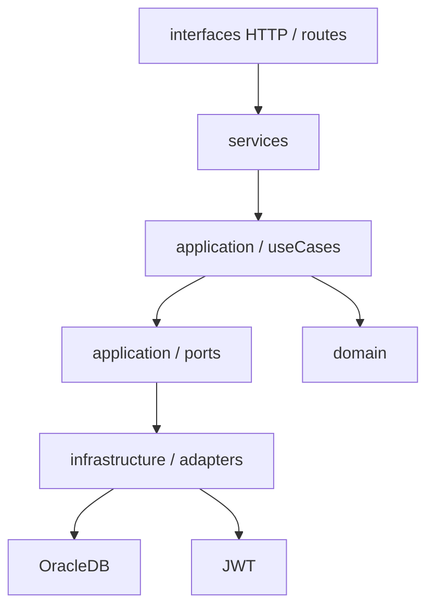

# Arquitetura do TCG.Bet

## Contexto

O TCG.Bet e uma aplicacao web para apostas em eventos futuros. Usuarios podem criar eventos, apostar, consultar carteira e movimentar saldo. Moderadores avaliam eventos e finalizam resultados.

O dominio nao e trivial porque envolve autenticacao, autorizacao por papel, dinheiro, historico financeiro, moderacao e apuracao de apostas. Por isso, as decisoes arquiteturais priorizam seguranca, consistencia e manutenibilidade.

## Decisao macro

O sistema foi mantido como **monolito modular**.

Motivos:

- O escopo atual cabe em um unico deploy.
- O time consegue desenvolver e demonstrar o sistema com menor custo operacional.
- Os limites de modulo ficam claros sem introduzir a complexidade de microsservicos.
- Transacoes de carteira, apostas e eventos dependem de consistencia forte no mesmo banco.

## Decisao interna

A organizacao interna segue uma arquitetura em camadas inspirada em Clean Architecture/Hexagonal:

Camadas principais:

- `src/domain`: regras puras de dominio, sem Express, Oracle ou JWT.
- `src/application`: casos de uso e portas. Orquestra regras e contratos.
- `src/infrastructure`: adaptadores concretos para Oracle e JWT.
- `src/services`: ponte de compatibilidade com as rotas existentes.
- `src/routes`: endpoints Express.
- `adrs`: registros de decisoes arquiteturais.
- `diagrams`: fontes Mermaid dos diagramas versionados.

## Atributos de qualidade prioritarios

Baseados na ISO/IEC 25010:2023:

- **Seguranca**: autenticacao por JWT, autorizacao entre usuario e moderador e hash de senha com `scrypt`.
- **Confiabilidade/consistencia**: operacoes financeiras e apostas mantidas em transacao.
- **Manutenibilidade**: regras centrais separadas de SQL e Express.
- **Testabilidade**: dominio e casos de uso dependem de interfaces, permitindo testes sem banco.
- **Auditabilidade**: carteira registra historico de deposito, saque, aposta e ganho.

## SOLID

- **SRP**: `MoveWalletFundsUseCase`, `PlaceBetUseCase` e `FinishEventUseCase` possuem responsabilidades especificas.
- **OCP**: `PayoutStrategy` permite novas politicas de premiacao sem alterar `FinishEventUseCase`.
- **LSP**: qualquer implementacao de `WalletRepository`, `BetRepository`, `EventRepository` ou `PayoutStrategy` pode substituir a atual.
- **ISP**: portas pequenas e focadas evitam contratos grandes.
- **DIP**: casos de uso dependem de interfaces; Oracle e JWT ficam em adaptadores.

## Padroes GoF aplicados

- **Strategy**: `PoolPayoutStrategy` implementa `PayoutStrategy` para calcular distribuicao de ganhos.
- **Factory Method/Factory**: `WalletTransactionFactory` centraliza criacao de transacoes de carteira.
- **Adapter**: `JwtOracleAuthAdapter`, `OracleWalletRepository`, `OracleBetRepository` e `OracleEventRepository` adaptam bibliotecas/infraestrutura para portas da aplicacao.

## Clean Code

Melhorias aplicadas:

- Regras de negocio extraidas de funcoes longas.
- Nomes mais explicitos para casos de uso, portas e adaptadores.
- Reducao de duplicacao em movimentacoes de carteira.
- Conversao de dinheiro centralizada em `toCents`.
- Testes automatizados para regras puras.
- `app.ts` separado de `server.ts`, melhorando testabilidade da aplicacao Express.

## Contrato de API

O contrato REST esta especificado em `docs/openapi.yaml` e tambem pode ser acessado pela aplicacao em `/openapi.yaml` quando o servidor estiver em execucao. Os diagramas fonte ficam em `diagrams/`.
